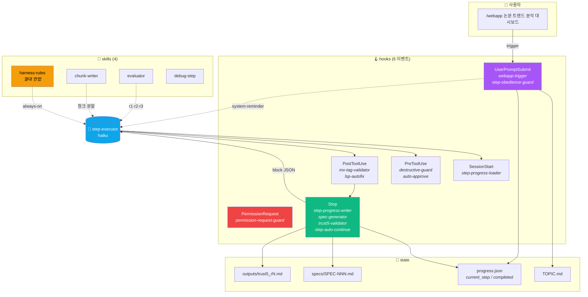
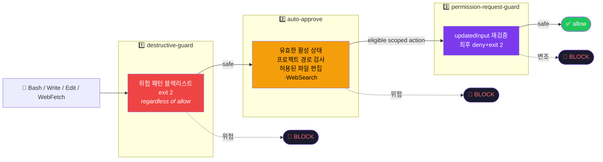
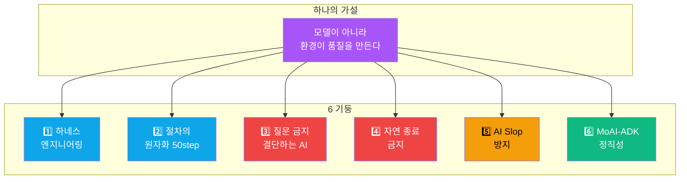
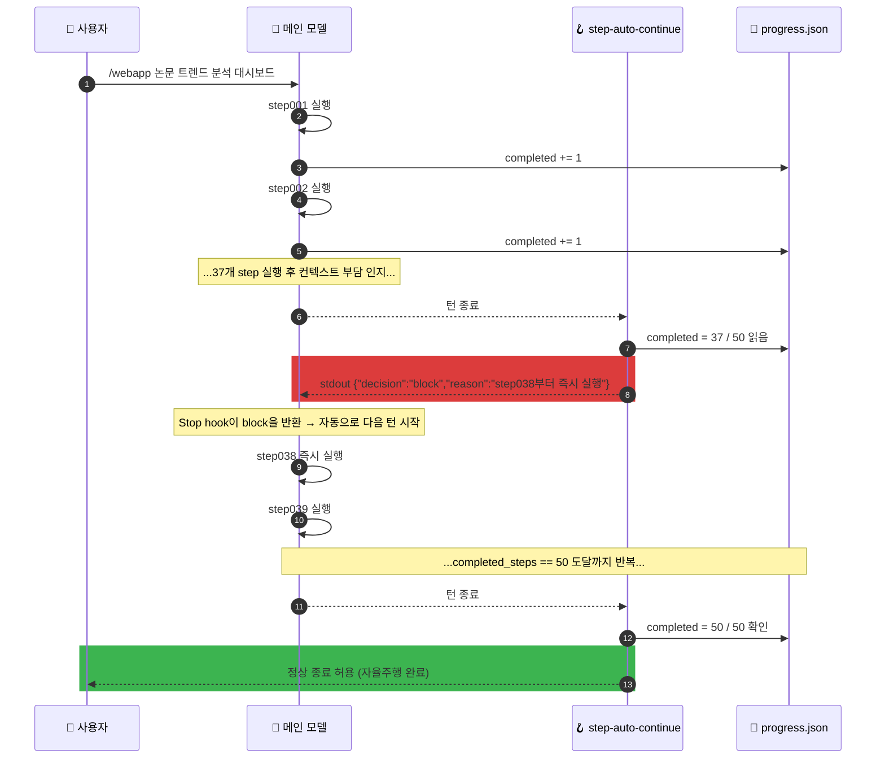

<div align="center">

# harness50

### 한 줄 요청 → 50 step 자율주행 → 인터랙티브 웹 튜토리얼 1편

**"논문 트렌드 분석 대시보드 만들어"** 한 줄을 던지면 컨텍스트 한계 직전까지 멈추지 않는 결정론적 절차가 가동된다.<br/>
모델을 똑똑하게 만드는 대신 **모델이 놓을 트랙을 좁힌다**.

<br/>

[](https://github.com/Technoetic/harness50)
[](LICENSE)
[](#-claude-code-설치)
[](hooks/)
[](assets/steps/)

[](tests/security-regression.sh)
[](hooks/destructive-guard.ps1)
[](hooks/)
[](skills/harness-rules/SKILL.md)

<br/>


<sub>데모 캐스트는 legacy 107단계 완주 실기록이다. v2.0부터 하네스는 50단계로 축약됐다 (원본은 <a href="https://github.com/Technoetic/harness50/tree/legacy-107"><code>legacy-107</code></a> 태그).</sub>

</div>

---

## Host commands / 호스트 명령

같은 50단계 절차를 사용하지만 호출 방식과 권한 모델은 호스트별로 다릅니다.

| Host | Start | Status | Reset |
|---|---|---|---|
| Claude Code | `/webapp <topic>` | `/harness-status` | `/harness-reset` |
| Codex | `$webapp <topic>` | `$harness50-status` | `$harness50-reset` |

Codex does not provide a `/webapp` slash command. Codex에서 기존 작업을 이어가려면 `$webapp resume`, 자동 이어가기를 멈추려면 `$webapp pause`를 사용합니다.

플러그인 이름이 표시되는 Codex에서는 `$harness50:webapp`, `$harness50:harness50-status`, `$harness50:harness50-reset`을 선택합니다. 짧은 이름과 같은 제어 요청으로 처리됩니다.

## Codex installation / 설치

### Local checkout

개발용 체크아웃을 설치하려면 아래 `<path-to-harness50>`에 저장소 루트를 지정합니다.

```text
codex plugin marketplace add <path-to-harness50>
codex plugin add harness50@harness50
```

### GitHub source

공개 저장소에서 Claude Code와 Codex 어댑터를 함께 설치할 수 있습니다.

```text
codex plugin marketplace add Technoetic/harness50
codex plugin add harness50@harness50
```

The published repository includes both Claude Code and Codex adapters. 설치 후에는 새 Codex 세션을 열고 아래 신뢰 게이트를 완료해야 합니다.

## Permissions and continuation / 권한과 이어가기

- Normal Codex permission confirmations remain in effect for every command.
- Harness50 never auto-approves commands and never changes sandbox or approval settings.
- Each later turn receives at most one 50-step continuation marker; that marker schedules work but grants no permission.
- Submitted command evidence is validated only as a string and exit status; the Harness50 runtime never executes that submitted command.
- The guard is a bounded, deny-only defense, not a shell sandbox; benign commands are never approved by the hook and still follow normal Codex permissions.

## Migration and reset / 마이그레이션과 리셋

- Only when no Codex workflow exists, existing Claude progress may be imported read-only once.
- Codex never writes back to Claude progress and never merges later Claude changes.
- Reset archives and deactivates only Codex control metadata.
- Reset preserves Claude progress, TOPIC, shared outputs, project source, and application source.

가져온 과거 완료 기록과 Codex에서 검증한 완료 기록은 별도로 표시됩니다.

## Hook trust gate / 후크 신뢰 게이트

1. Start a fresh Codex session after installation and verify that all three skills are visible.
2. Open `/hooks` and inspect the exact installed `codex/hooks/hooks.json` definition and its four synchronous handlers: `PreToolUse`, `SessionStart`, `UserPromptSubmit`, and `Stop`.
3. Confirm that no approval hook is present, then manually trust only those exact current definitions.
4. Changed hook hashes require review and manual trust again; never bypass or automate this trust step.

Local installation stops at this trust gate until the user confirms the review. 신뢰 전에는 Codex가 플러그인 후크를 건너뛰므로 `$webapp` 실행 검증도 그 뒤에 진행합니다.

## Host compatibility / 호스트 호환성

Claude Code keeps its slash commands; version 2.2 repairs installed hooks and limits automatic approval to eligible project edits and WebSearch. Bash와 WebFetch는 정상 권한 확인을 거칩니다. 완료·일시정지·손상된 진행 상태에서는 자동 승인하지 않습니다.

The full continuation lifecycle requires Codex CLI hooks; other hosts may discover the skills but must not claim continuation-hook support.

## 2.2 실행 신뢰성과 품질 검증

Windows PowerShell 원본 훅 실행, 프로젝트별 중단 상태, Codex 하위 에이전트 분리와 중단된 잠금 복구를 회귀 검사합니다. 두 호스트 모두 Node.js 22 이상이 필요합니다.

Trust5는 폴더 존재에 점수를 주지 않습니다. 실제 테스트·린트·타입·보안 명령의 종료 코드와 85% 이상 커버리지를 확인하며, 없거나 오래된 증거는 미완료로 표시합니다. 최종 HTML은 Chromium의 데스크톱·모바일 화면에서 오류, 접근성, 가로 넘침을 검사합니다. 설정과 실행 명령은 [품질 검증 안내](docs/QUALITY.md)를 참고하세요.

자동 검사는 학습 효과나 디자인 완성도 점수를 대신하지 않습니다. 실제 생성물의 평가는 별도 주제별 실행과 사용자 검증이 필요합니다.

<div align="center">

## ⚡ Claude Code: 30초 안에 이해하기

</div>

```text
사용자 →  /webapp 논문 트렌드 분석 대시보드
                        ↓
   webapp-trigger.hook  TOPIC.md 자동 작성 + step001~050 부트스트랩
                        ↓
   step001.md  ───────►  prefill 도구 검증 (Node, npx, Playwright, Biome, …)
   step002.md  ───────►  컨텍스트 전략 청크 작성
   step016.md  ───────►  웹 조사 병렬 서브에이전트 (haiku × 10)
   step025.md  ───────►  4단계 카드 스토리보드 기획
   step030.md  ───────►  통합 설계 (디자인 토큰·SVG·ARIA)
   step037.md  ───────►  단일 HTML 인터랙티브 튜토리얼 구현
   step038.md  ───────►  빌드 스모크 게이트 + TRUST 5 r1 (50점 만점)
   step044.md  ───────►  구조 정리 완료 + TRUST 5 r2
   step045.md  ───────►  E2E 테스트 (프리플라이트 흡수)
   step050.md  ───────►  콘솔 에러 0 + 최종 build 게이트 + TRUST 5 r3
                        ↓
   Stop hook  ────►  진행 미완료면  {"decision":"block"}  →  자동 재개
                        ↓
            50 step 완주 후에야 사용자에게 컨트롤 반환
```

> [!IMPORTANT]
> 진짜 종료 조건은 단 하나: **컨텍스트 한계 도달**. <br/>
> "이만하면 충분"이라는 모델의 자기판단을 위반으로 정의한다.

---

<div align="center">

## 🎯 무엇을 만들어 주는가

</div>

| 입력 | 산출 |
|:---|:---|
| `/webapp 논문 트렌드 분석 대시보드` | 분야별 발표량 stacked area + 키워드 폭증 막대 + 연도 슬라이더 + 핫토픽 카드 |
| `/webapp 논문 인용 네트워크` | force-directed 인용 관계망 + 시간축 애니메이션 + 검색·필터 + 영향력 노드 강조 |
| `/webapp 저자 연구 활동 대시보드` | h-index·인용 추이 KPI + 공저자 네트워크 + 키워드 워드클라우드 + 연도별 라인 |
| `/webapp Literature Review 대시보드` | 논문 분류 매트릭스 + 갭 분석 다이어그램 + 읽기 큐 카드 + 태그 클라우드 |
| 자연어 `"... 대시보드 만들어줘"` | 위 넷과 동일. 트리거 패턴 7종 모두 지원 |

산출물 = **단일 HTML 파일** (Helvetica Neue / 8 배수 grid / accent 1색 / radius {0,4,8,12,16} / 터치 44pt / ARIA 필수).

**독립 화면마다 고유 주소를 갖습니다.** 기본은 `index.html#/orders` 같은 hash
라우팅이며 HTML 파일은 하나로 유지합니다. 설계에서 화면별 주소를 정하고, 최종
검사에서 모든 주소의 직접 접속·새로고침·링크 이동·뒤로/앞으로 가기를 확인합니다.
서버 경로(`/orders`, `/orders.html`)는 같은 HTML로 연결하는 배포 설정을 갖춘
history 모드에서 지원합니다. HTTP(S)에서는 사용 가능한 Navigation API를 우선 쓰고,
미지원 환경에서는 기존 History API·hash 처리로 동작합니다. 파일 직접 열기는 hash를
유지합니다. 최종 schema 3 검사는 일반 환경과 Navigation API를 강제로 제거한 환경에서
전체 화면을 각각 검증합니다. [화면 주소 계약](docs/ROUTING.md)과
[실행 가능한 단일 파일 예제](examples/routed-single-file.html)를 참고하세요.

---

<div align="center">

## 🏗️ Claude Code 아키텍처

</div>



---

<div align="center">

## 🛡️ Claude Code: 9회차 감사로 검증된 안전 모델

</div>

활성 작업의 프로젝트 내부 파일 편집과 WebSearch만 제한적으로 자동 승인합니다. 셸 명령과 WebFetch는 호스트의 권한 정책을 따르며, 알려진 위험 명령과 민감 경로는 계속 차단합니다.

> [!IMPORTANT]
> **auto-approve는 유효한 진행 상태에서만 발화합니다.** 완료 단계가 연속되고 현재 단계가 일치해야 합니다. 파일이 없거나 JSON이 손상됐거나 일시정지·완료 상태라면 정상 권한 흐름을 따릅니다. 경로는 `..`, 버전이 포함된 플러그인 캐시, 디렉터리 링크를 포함해 검사합니다.
>
> 아래 감사 기록은 이전 버전의 이력입니다. 현재 회귀 검사는 [`tests/security-regression.sh`](tests/security-regression.sh)와 [`codex/tests/claude-security.test.mjs`](codex/tests/claude-security.test.mjs)에서 위험 명령 차단, 일반 셸 명령의 권한 위임, 비활성 상태와 경로 우회를 확인합니다. 경로 검사는 파일시스템 샌드박스를 대신하지 않습니다.



<br/>

<div align="center">

</div>

<details>
<summary><b>📊 9회차 감사 누적 보강 — 클릭하여 펼치기</b></summary>

| 회차 | 발견 | 핵심 보강 |
|:---:|:---|:---|
| 1 | -40 | PreToolUse `permissionDecision:"allow"` 메커니즘 발견. "절대 불가" 결론 뒤집힘 |
| 2 | -10 | hook chain 병렬 실행 확인. destructive-guard와 race condition 발견 + 22개 위험 패턴 보강 |
| 3 | -60 | E1 SSH key write / E2 자기 무력화 / E3 SSRF·악성 URL 실증 → 민감 경로 19종 + 위험 URL 5종 추가 |
| 4 | -60 | PermissionRequest hook 신규 등록. `updatedInput` 변조 가능성. 경로 정규화 + `new_string` 검사 |
| 5 | -30 | destructive-guard에 4회차 보강 미반영 발견 → 27개 패턴 동기화. 8.3 short name expand (0.04ms) |
| 6 | -10 | WSL2 9p auto-expand로 short name 우회 → realpath + fallback 추가 |
| 7 | -30 | 3중 hook 동기화 갭 3건. MultiEdit `edits[].new_string`에서 sudo 자동승인 발견 |
| 8 | -210 | 권한 상승·설치·리버스쉘 패턴 20건 잔존 → 23 PoC 카테고리 전수 차단 |
| 9 | 0 | **개발 감사 사이클 종료** |
| 재현 | — | **커밋된 `tests/security-regression.sh` — 45 케이스 (차단 18 + 승인 8 + 게이트) 통과. 신규 커버: 변수 인다이렉션·인터프리터 삭제·git hooksPath·2단계 다운로드·자격증명 유출** |

위 회차별 셀 수는 개발 과정의 감사 기록이며, 저장소에서 재현 가능한 검증은 `tests/security-regression.sh`(45 케이스)다. 감사 로그 원본은 커밋되어 있지 않다 — 재현 가능한 증거는 이 테스트 스위트로 대체한다.

</details>

> [!CAUTION]
> harness50는 **brainstorming / TDD 등 superpowers skill의 HARD-GATE를 의도적으로 무력화**한다.<br/>
> 다른 사용자가 이 플러그인을 깐 상태에서 일반 대화를 시도하면 "질문 없이 즉시 실행" 모드가 된다.<br/>
> 활성 조건: `/webapp` 트리거 또는 `progress.json` 활성. 그 외엔 대부분 hook이 silent skip.

---

<div align="center">

## 🧱 6개 핵심 철학

</div>



| # | 철학 | 한 줄 |
|:---:|:---|:---|
| 1 | **하네스 엔지니어링** | 모델을 똑똑하게 만들기 전에 트랙·가드·게이트·기록을 깔아라 |
| 2 | **절차의 원자화** | 한 step은 한 책임. 끝나면 다음 step 즉시 호출 |
| 3 | **질문 금지** | "진행할까요?"는 위반. 모호하면 결정 + 산출물에 1줄 사유 기록 |
| 4 | **자연 종료 금지** | "이만하면 충분"은 위반. 컨텍스트 한계 직전까지 계속 |
| 5 | **AI Slop 방지** | 8 배수 grid · 폰트 4 · accent 1 · radius 5 · 44 pt 터치 |
| 6 | **MoAI-ADK 정직성** | @MX 4종 태그 · EARS-라이트 SPEC · TRUST 5 게이트 |

전문은 [`skills/harness-rules/SKILL.md`](skills/harness-rules/SKILL.md). 활성화 시 모든 step·모든 서브에이전트가 자동 상속.

---

<div align="center">

## 📦 무엇이 들어 있나

</div>

```
harness50/
├── .claude-plugin/
│   ├── plugin.json                    ← v1.0.0 · MIT
│   └── marketplace.json               ← /plugin marketplace add 진입점
├── tests/
│   └── security-regression.sh         ← 45 케이스 안전 회귀 (재현 가능)
├── commands/                          ← 3개 슬래시 커맨드
│   ├── webapp.md                      ← /webapp <주제>  자율주행 진입
│   ├── harness-status.md              ← /harness-status 1줄 진행 보고
│   └── harness-reset.md               ← /harness-reset  progress.json 리셋
│
├── skills/                            ← 4개 스킬
│   ├── harness-rules/SKILL.md         ← 헌법: 질문 금지 / AI Slop / @MX 의무
│   ├── chunk-writer/SKILL.md          ← 500줄 이하 청크 분할
│   ├── evaluator/SKILL.md             ← 생성자–평가자 분리 (sonnet 4축)
│   └── debug-step/SKILL.md            ← c8 + 서브에이전트 병렬 디버깅
│
├── agents/
│   └── step-executor.md               ← 단일 step 실행 워커 (haiku 고정)
│
├── hooks/                             ← 14쌍 = 28 파일 (.ps1 + .sh)
│   ├── hooks.json                     ← 6개 이벤트 바인딩
│   ├── html-bundler.{ps1,sh}          ← src/ → 단일 dist/index.html 번들러
│   ├── webapp-trigger.{ps1,sh}        ← 트리거 감지 + 부트스트랩 (번들러 프로젝트 복사 포함)
│   ├── step-obedience-guard.{ps1,sh}  ← 매 prompt마다 다음 step 강제
│   ├── step-progress-loader.{ps1,sh}  ← SessionStart 로드
│   ├── step-progress-writer.{ps1,sh}  ← transcript 스캔 + 원자적 write
│   ├── step-auto-continue.{ps1,sh}    ← Stop 시 block JSON 자동 재개  🔥
│   ├── destructive-guard.{ps1,sh}     ← 125+ 위험 패턴 차단  🛡️
│   ├── auto-approve.{ps1,sh}          ← 200+ 사전 검증 + 화이트리스트  🛡️
│   ├── permission-request-guard.{ps1,sh}  ← updatedInput 변조 방어  🛡️
│   ├── mx-tag-validator.{ps1,sh}      ← @MX 4종 태그 검증
│   ├── lsp-autofix.{ps1,sh}           ← Biome / Stylelint 자동수정
│   ├── spec-generator.{ps1,sh}        ← SPEC-NNN.md 자동 생성
│   ├── trust5-validator.{ps1,sh}      ← r1·r2·r3 50점 만점 평가
│   └── validate-tools.{ps1,sh}        ← 도구 검증 wrapper
│
└── assets/steps/                      ← 50개 결정론적 절차
    ├── step001.md  하네스 프리플라이트
    ├── step002.md  컨텍스트 전략
    ├── …
    ├── step038.md  ⭐ 빌드 스모크 게이트 (TRUST 5 r1)
    ├── step044.md  ⭐ 구조 정리 완료 (TRUST 5 r2)
    ├── step045.md  E2E 테스트 (구 step084 프리플라이트 흡수)
    └── step050.md  ⭐ 콘솔 에러 0 + 최종 게이트 (TRUST 5 r3)
```

---

<div align="center">

## 🎬 자율주행 데모 — Stop hook의 마법

</div>

이 한 줄이 **컨텍스트 한계 직전까지 멈추지 않는 자율 실행**의 핵심이다.

<div align="center">

</div>

<br/>



질문 패턴(`"진행할까요?"`, `"다음 턴에서 재개"` 등 50+개) 감지 시 `[VIOLATION DETECTED]` reason과 함께 강제 재실행. 모델이 빠져나갈 길은 progress.json이 50이 되는 그 시점뿐이다.

---

<div align="center">

## 🚀 Claude Code 설치

</div>

### 방법 1 — Claude에게 자연어로 부탁 (가장 자연스러움)

Claude Code 터미널에서 평소처럼 말 걸면 됩니다. 메인 에이전트가 슬래시 명령 절차를 안내해 줍니다.

```text
harness50 플러그인을 깔아줘. Technoetic/harness50 레포에 있어.
```

Claude가 다음 2단계를 차례로 안내합니다 (사용자가 직접 입력):

```text
/plugin marketplace add Technoetic/harness50
/plugin install harness50@harness50
```

> [!IMPORTANT]
> `/plugin` 슬래시 명령은 **사용자가 직접 입력**해야 적용됩니다. Claude가 Bash 도구로 대신 실행할 수 없습니다 (보안 제약). Claude는 명령 텍스트를 안내만 합니다.

### 방법 2 — 슬래시 명령 직접 입력 (이미 익숙한 사용자)

마켓플레이스 등록 → 설치 2단계:

```text
/plugin marketplace add Technoetic/harness50
/plugin install harness50@harness50
```

### 방법 3 — 로컬 경로 (개발 / 커스터마이즈)

레포를 clone한 뒤 `~/.claude/settings.json` 또는 프로젝트 `.claude/settings.local.json`에 경로 등록:

```jsonc
{
  "plugins": {
    "harness50": {
      "path": "/absolute/path/to/harness50"
    }
  }
}
```

또는 CLI 진입 시 플래그로 1회 로드:

```bash
claude --plugin-dir ./path/to/harness50
```

### 프로젝트 의존성 (1회)

```bash
npm i -D @biomejs/biome stylelint vitest playwright @axe-core/playwright c8 jscpd madge
npx playwright install chromium
```

선택: `semgrep` (Trust5 Secured 축에서 9점/4점 분기).

> [!TIP]
> step001이 첫 실행 시 자동으로 도구 검증 + 누락분 설치까지 처리한다. 위 명령은 수동 설치를 원할 때만.

---

<div align="center">

## 📡 사용

</div>

### 자율주행 시작

```text
/webapp 논문 트렌드 분석 대시보드
```

또는 자연어:

```text
논문 분야별 트렌드를 보여주는 대시보드를 만들어줘
```

또는 요구사항을 한 번에 못박고 싶을 때 — 트리거 매칭 신뢰도가 가장 높습니다:

```text
주제: 논문 트렌드 분석 대시보드

연구자가 한눈에 분야별 흐름을 짚을 수 있는
인터랙티브 대시보드를 한 편 만들어줘.

- 연도별 분야 발표량을 stacked area 차트로 시각화
- 키워드 폭증 추이와 핫토픽을 카드로 강조
- 연도 슬라이더 · 카테고리 토글 · 키워드 클릭으로 즉시 필터
- 한 페이지 단일 HTML로 완결
```

### 진행 상태 확인

```text
/harness-status
→ harness50: 37/50 완료 | current=step038 | r1=- r2=- r3=-
```

### 처음부터 다시

```text
/harness-reset
→ harness50 리셋 완료 — step001부터 재시작 가능
```

`/harness-reset`은 `step_archive/archived/`, `specs/`, `outputs/`는 보존. progress.json만 초기화.

---

<div align="center">

## 🧪 평가 게이트 — TRUST 5 (50점 만점)

</div>

| 축 | 측정 | 만점 | 임계 |
|:---|:---|:---:|:---:|
| **Tested** 테스트성 | `coverage/` 디렉토리 + vitest 결과 | 10 | 7 |
| **Readable** 가독성 | Biome check 0 errors | 10 | 7 |
| **Unified** 일관성 | `src/` 구조 + 디자인 토큰 단일화 | 10 | 7 |
| **Secured** 보안성 | semgrep `--config=auto` findings 0 | 10 | 7 |
| **Trackable** 추적성 | `@MX` 4종 태그 커버리지 | 10 | 7 |
| **총점** | | **50** | **40** PASS |

평가 라운드: r1 = step038 / r2 = step044 / r3 = step050 도달 시 자동 발화.<br/>
40점 이상 PASS · 40점 미만 WARN (fail-open, 자율주행은 계속).

---

<div align="center">

## 🪝 6개 hook 이벤트 한눈에

</div>

| 이벤트 | 실행 hook | 역할 |
|:---|:---|:---|
| **UserPromptSubmit** | webapp-trigger → step-obedience-guard | 트리거 패턴 감지 시 부트스트랩. 그 외엔 다음 step 강제 |
| **SessionStart** | step-progress-loader | progress.json 로드 + 다음 step 지시 주입 |
| **PreToolUse** | destructive-guard + auto-approve | 위험 차단 + 화이트리스트 자동 승인 (병렬, exit 2 우선) |
| **PermissionRequest** | permission-request-guard | `updatedInput` 변조 방어용 최후 검증 (deny+exit 2) |
| **PostToolUse** | mx-tag-validator + lsp-autofix | @MX 태그 검증 + Biome/Stylelint 자동수정 |
| **Stop** | step-progress-writer → spec-generator → trust5-validator → step-auto-continue | progress 갱신 → SPEC 생성 → r1/r2/r3 평가 → 미완료면 block JSON |

---

<div align="center">

## ⚠️ 안전 모델 한계 (정직성)

</div>

> [!NOTE]
> hook 차원에서 완전 차단이 불가능한 잔여 한계를 정직하게 명시한다.

| # | 한계 | 영향 | 대응 |
|:---:|:---|:---|:---|
| 1 | 다른 플러그인의 `bin/` 자동 PATH 상속 | bare `rm` 호출 시 fake binary로 shadow 가능 | 다중 플러그인 enable 시 각 `bin/` 직접 검토 |
| 2 | PreToolUse `updatedInput` 머지 우선순위 미명시 | 변조본이 destructive-guard 검사 후 적용 가능성 | permission-request-guard가 변조 결과 재검증 |
| 3 | Windows 사용자 short name (`~/ADMINI~1`) | LLM 자발 생성 가능성 매우 낮음 | well-known 7토큰 fallback 차단 |
| 4 | **블랙리스트 방식의 본질적 불완전성** | 셸 동치표현은 무한(변수·인터프리터·인코딩·2단계) — 알려진 우회만 차단 | `tests/security-regression`으로 회귀 고정. 근본 대응은 화이트리스트 역전(로드맵) |
| 5 | **진행 추적이 transcript 정규식 스캔 의존** (H8) | 완료 문구 변형 시 미기록→재개, 예시 인용 시 오집계 위험 | 코드펜스·인용 가드로 오탐 완화. 상태전이가 LLM 산문에 걸리는 구조적 약점은 잔존 |
| 6 | **step 본문이 참조하는 검증기 다수 미번들** (H5) | tokei/c8/biome/semgrep 등 `*-validator.ps1` 24종 부재 | 부재 시 해당 단계 fail-open(건너뜀). 목록·정책은 [`docs/RETIRED-VALIDATORS.md`](docs/RETIRED-VALIDATORS.md) |

2.2부터 Bash와 WebFetch는 정상 권한 확인을 거칩니다. 위험 패턴 검사는 추가 방어이며,
호스트 권한 정책이나 파일시스템 샌드박스를 대체하지 않습니다.

### 재현 가능한 검증

```bash
# POSIX (macOS/Linux) — .sh 훅 대상
bash tests/security-regression.sh
```
```powershell
# Windows — .ps1 훅 대상 (실제 Windows에서 실행되는 경로)
powershell -NoProfile -ExecutionPolicy Bypass -File tests/security-regression.ps1
```

두 스위트 모두 45 케이스(위험 18 차단 + 정상 8 승인 + 게이트)를 검사한다. Windows에서는 `.sh` 훅이 OS 가드로 no-op되므로 `.ps1` 스위트가 검증 SoT다.

---

<div align="center">

## 🧬 영감 / 출처

</div>

| 출처 | 무엇을 빌렸나 |
|:---|:---|
| [**Technoetic/claude-code-commands**](https://github.com/Technoetic/claude-code-commands) | **자매 레포** — harness50의 9회차 audit 패턴이 원래 어디서 왔는지 보여주는 1년치 슬래시 명령 20종 컬렉션 |
| [MoAI-ADK](https://github.com/moai-research/MoAI) | @MX 4종 태그 시스템 · TRUST 5 게이트 · EARS SPEC 형식 |
| [superpowers](https://github.com/anthropics/skills) | brainstorming · TDD · debugging skill 골격 (HARD-GATE는 의도적 무력화) |
| [Claude Code 공식 hooks](https://docs.claude.com/en/docs/claude-code/hooks) | `{"decision":"block"}` 자동 재개 메커니즘 · PreToolUse `permissionDecision:"allow"` |
| Obsidian vault | 6개 핵심 철학 · `_규칙/HARNESS-규칙.md` · `_규칙/NEW-WORK-규칙.md` |

---

<div align="center">

## 📄 라이선스

[](LICENSE)

MIT License · Copyright (c) 2026 [Technoetic](https://github.com/Technoetic)

<br/>

**모델을 믿지 말고 하네스를 믿어라.**

<br/>

[](https://github.com/Technoetic/harness50)
[](https://github.com/Technoetic/harness50/stargazers)

</div>
